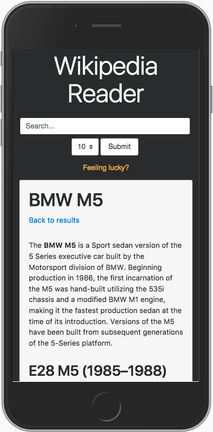

# Wikipedia Reader

A Wikipedia reader that parses Wikipedia articles into easy to read text without leaving the app.




### Live Demo

[index.html](https://adamelliotfields.github.io/free-code-camp/front-end-development/6-wikipedia-search/index.html)


### Notes

While I wasn't blown away by Wikipedia's API docs (thank God for Stack Overflow), I was pleased with how powerful the API is. It's even possible to get the full HTML for an entire article, including all links and images.

I attempted to use some alternative CSS frameworks like Skeleton, Pure, and Bulma, but went back to tried-and-true Bootstrap. Bootstrap 4 cards are perfect for this app, and the time it takes to learn a new micro-framework is not worth the 100kb I'd save (but they are still excellent alternatives).

I'm using the [Zepto.js](http://zeptojs.com/) JavaScript library which is super light-weight and fast compared to jQuery. 


### Search

For querying Wikipedia, I'm using the Generator API to generate text snippets of the articles. If you only want article titles, the plain Search API is fine.

I'm using the `encodeURIComponent()` method to convert the search text into a query string (e.g., `&` is converted to `%26`).

Each result is given the `pageid` tag which will be used to retrieve the article later.

In order to limit unnecessary API requests, I'm caching the results in an object, so you can go back to your results after viewing an article without calling the API again.

```
https://en.wikipedia.org/w/api.php?action=query&generator=search&gsrnamespace=0&gsrsearch=BMW_M5&gsrlimit=10&prop=extracts&exintro&exsentences=10&exlimit=10&format=json
```

`action=query` initiates our request.

`generator=search` uses the output of a list (search results) instead of querying an article by title/pageid directly.

`gsrnamespace=0` restricts our search to only articles (articles have a namespace of 0).

`gsrsearch=BMW_M5` is our search string.

`gsrlimit=10` limits how many search results we want back.

`prop=extracts` the `extracts` property returns extracted HTML from the article, but strips images, links, tables, etc. Basically, it returns only the stuff you actually read.

`exintro&exsentences=10` sets the number of sentences to return, including the intro (only some articles have an intro). I use 10 because I ultimately use RegEx `/<p>.*<\/p>/` to strip the text between the first opening and closing `p` tags, so each snippet is an actual paragraph.

`exlimit=10` limits the number of results that include an extract, alternatively you can use `max`.

`format=json` because it's not XML.


### Article

Parsing the extracted text is as easy as a simple `.append()` method. I've added a few CSS rules to give whitespace between headings in the article.

Each result is delegated an event handler that initiates a GET request for a specific page ID.

```
https://en.wikipedia.org/w/api.php?action=query&pageids=1178676&prop=extracts&format=json
```

`pageids=1178676` is the page ID (use `.attr('id')` to get it).

`prop=extracts` is the same as before, except this time, no sentence limit is set.


### Random Article

This is similar to the search request, except for the key difference of `generator=random`.

```
https://en.wikipedia.org/w/api.php?action=query&generator=random&grnnamespace=0&grnlimit=1&prop=extracts&format=json
```


### HTML Article

If you want the entire article, including all links, images, tables, etc, use `action=parse` and `prop=text`. You'll probably want to create some custom CSS rules to make it display properly.

If you don't know the `pageid`, you can just use `page=BMW_M5` instead.

```
https://en.wikipedia.org/w/api.php?action=parse&pageid=1178676&prop=text&format=json
```
